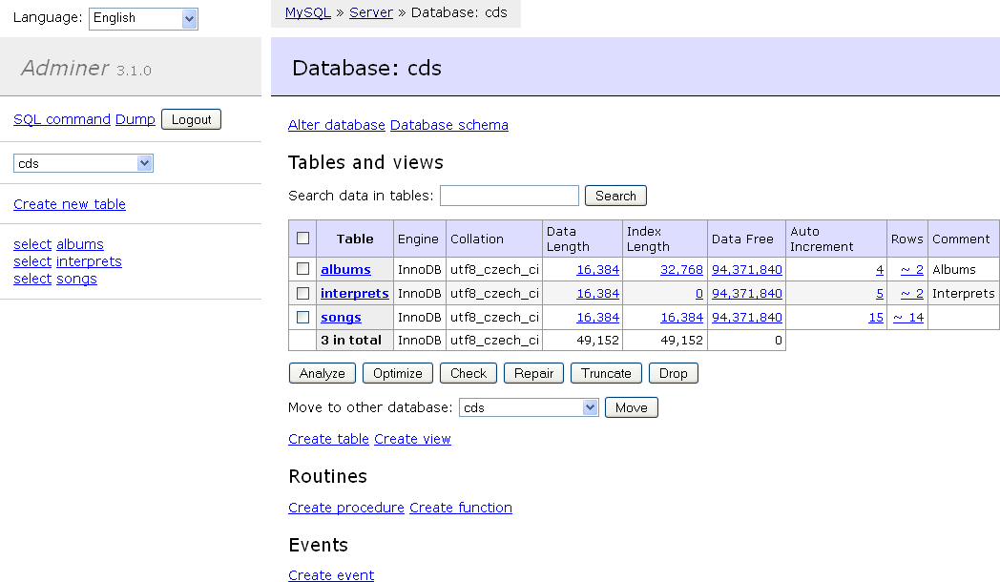

<!--
N.B.: This README was automatically generated by https://github.com/YunoHost/apps/tree/master/tools/README-generator
It shall NOT be edited by hand.
-->

# Adminer pour YunoHost

[](https://dash.yunohost.org/appci/app/adminer)  

[](https://install-app.yunohost.org/?app=adminer)

*[Read this readme in english.](./README.md)*

> *Ce package vous permet d’installer Adminer rapidement et simplement sur un serveur YunoHost.
Si vous n’avez pas YunoHost, regardez [ici](https://yunohost.org/#/install) pour savoir comment l’installer et en profiter.*

## Vue d’ensemble

Adminer (anciennement phpMinAdmin) est un outil de gestion de base de données complet écrit en PHP. À l'inverse de phpMyAdmin, il se compose d'un seul fichier prêt à être déployé sur le serveur cible. Adminer est disponible pour MySQL, MariaDB, PostgreSQL, SQLite, MS SQL, Oracle, Elasticsearch, MongoDB et autres via un plugin. 

**Version incluse :** 4.8.1~ynh6

**Démo :** https://demo.adminer.org/adminer.php?username=

## Captures d’écran



## Documentations et ressources

* Site officiel de l’app : <https://www.adminer.org/>
* Dépôt de code officiel de l’app : <https://github.com/vrana/adminer/>
* Documentation YunoHost pour cette app : <https://yunohost.org/app_adminer>
* Signaler un bug : <https://github.com/YunoHost-Apps/adminer_ynh/issues>

## Informations pour les développeurs

Merci de faire vos pull request sur la [branche testing](https://github.com/YunoHost-Apps/adminer_ynh/tree/testing).

Pour essayer la branche testing, procédez comme suit.

``` bash
sudo yunohost app install https://github.com/YunoHost-Apps/adminer_ynh/tree/testing --debug
ou
sudo yunohost app upgrade adminer -u https://github.com/YunoHost-Apps/adminer_ynh/tree/testing --debug
```

**Plus d’infos sur le packaging d’applications :** <https://yunohost.org/packaging_apps>