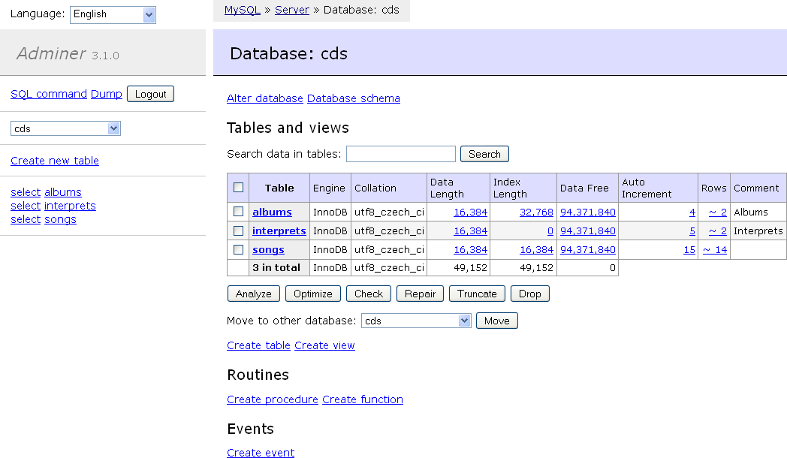

<!--
To README zostało automatycznie wygenerowane przez <https://github.com/YunoHost/apps/tree/master/tools/readme_generator>
Nie powinno być ono edytowane ręcznie.
-->

# Adminer dla YunoHost

[](https://ci-apps.yunohost.org/ci/apps/adminer/)


[](https://install-app.yunohost.org/?app=adminer)

*[Przeczytaj plik README w innym języku.](./ALL_README.md)*

> *Ta aplikacja pozwala na szybką i prostą instalację Adminer na serwerze YunoHost.*  
> *Jeżeli nie masz YunoHost zapoznaj się z [poradnikiem](https://yunohost.org/install) instalacji.*

## Przegląd

Adminer (formerly phpMinAdmin) is a full-featured database management tool written in PHP. Conversely to phpMyAdmin, it consist of a single file ready to deploy to the target server. Adminer is available for MySQL, MariaDB, PostgreSQL, SQLite, MS SQL, Oracle, Elasticsearch, MongoDB and others via plugin.

**Dostarczona wersja:** 4.17.1~ynh1

**Demo:** <https://demo.adminer.org/adminer.php?username=>

## Zrzuty ekranu



## :red_circle: Niepożądane funkcje

- **Upstream not maintained**: This software is not maintained anymore. Expect it to break down over time, be exposed to unfixed security breaches, etc.

## Dokumentacja i zasoby

- Oficjalna strona aplikacji: <https://www.adminer.org/>
- Repozytorium z kodem źródłowym: <https://github.com/vrana/adminer/>
- Sklep YunoHost: <https://apps.yunohost.org/app/adminer>
- Zgłaszanie błędów: <https://github.com/YunoHost-Apps/adminer_ynh/issues>

## Informacje od twórców

Wyślij swój pull request do [gałęzi `testing`](https://github.com/YunoHost-Apps/adminer_ynh/tree/testing).

Aby wypróbować gałąź `testing` postępuj zgodnie z instrukcjami:

```bash
sudo yunohost app install https://github.com/YunoHost-Apps/adminer_ynh/tree/testing --debug
lub
sudo yunohost app upgrade adminer -u https://github.com/YunoHost-Apps/adminer_ynh/tree/testing --debug
```

**Więcej informacji o tworzeniu paczek aplikacji:** <https://yunohost.org/packaging_apps>
